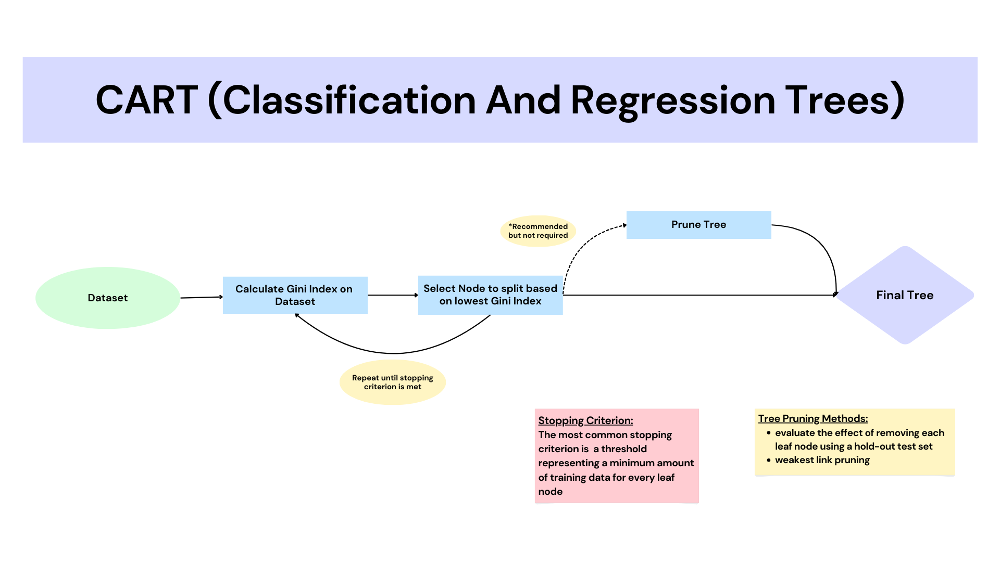
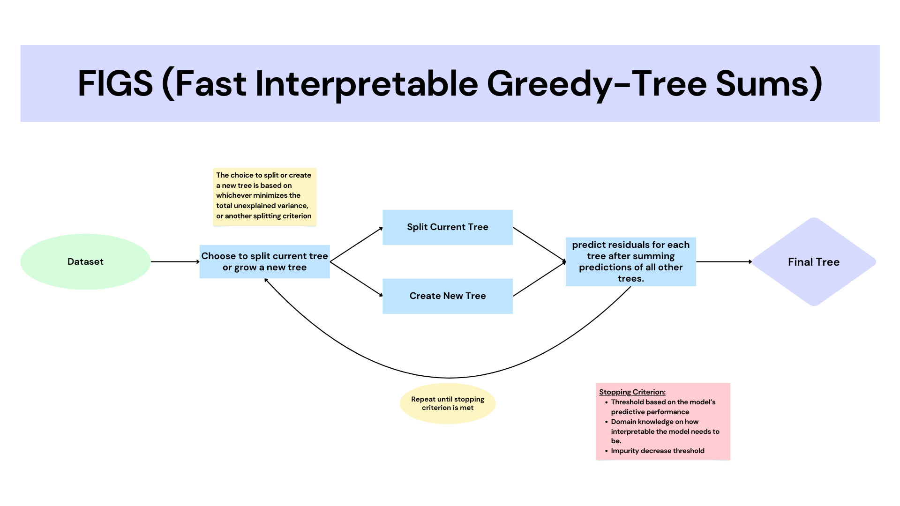
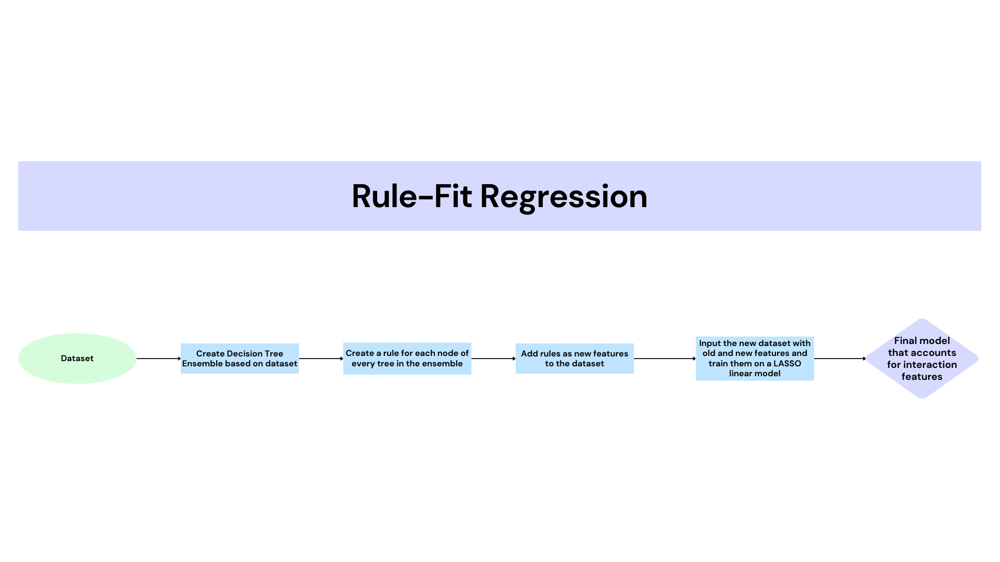

# InterpretableML_II
This notebook demonstrates the CART, FIGS and Rule-Fit algorithms which can be found [here](https://github.com/csinva/imodels?tab=readme-ov-file) and are part of Python's imodels interpretability library.

## CART (Classification And Regression Tree)
The Cart Approach:
1. CART works by using a greedy approach for splitting. Different splitting points are tested using a cost function (generally SSE for regression and Gini Index for classification)
2. The algorithm chooses to split the node based on the minimum cost 
3. Repeat the process until the stopping criterion is reached. The most common stopping criterion used for cart is a threshold representing a minimum amount of training data for every leaf node.
4. It is recommended to Prune the tree before outputting the final model, but it is not required. 
5. Output the final tree

### FIGS (Fast Interpretable Greedy-Tree Sums)
The FIGS Approach:
1. Given a dataset, at each iteration of FIGS there is the option to split a current tree or create a new tree. The choice to split or create
a new tree is either based on whichever minimizes the total unexplained variance or another splitting criterion.
2. After splitting (or creating the new tree), the model predicts the residuals for each tree after summing the predictions over all other trees.
3. This process is repeated until a stopping criterion is met. Some common stopping criterions are:
    - A threshold based on the model's predictive performance
    - Domain knowledge on how interpretable the model needs to be
    - Impurity decrease threshold

### Rule-Fit Regression
The Rule-Fit Approach:
1. Create a decision-tree ensemble based on a dataset
2. The rulefit algorithm creates a rule (which is binary) for each node of every tree in the ensemble
3. Once rules are generated they are added as new features to the original dataset
4. We then fit the new data on a LASSO regularized linear regression model which accounts for the interaction features

